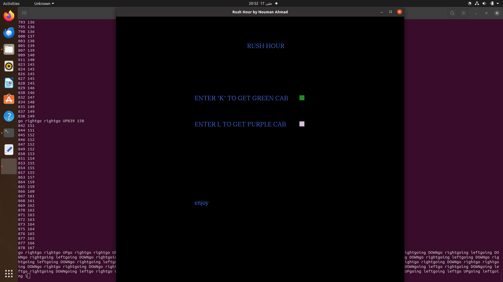
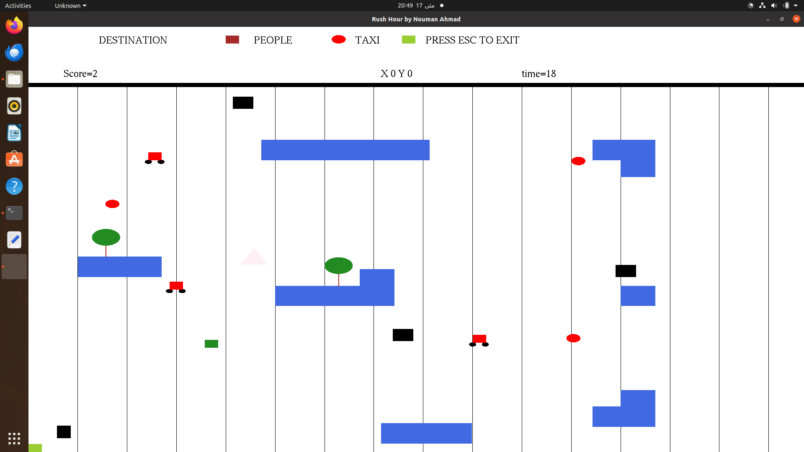
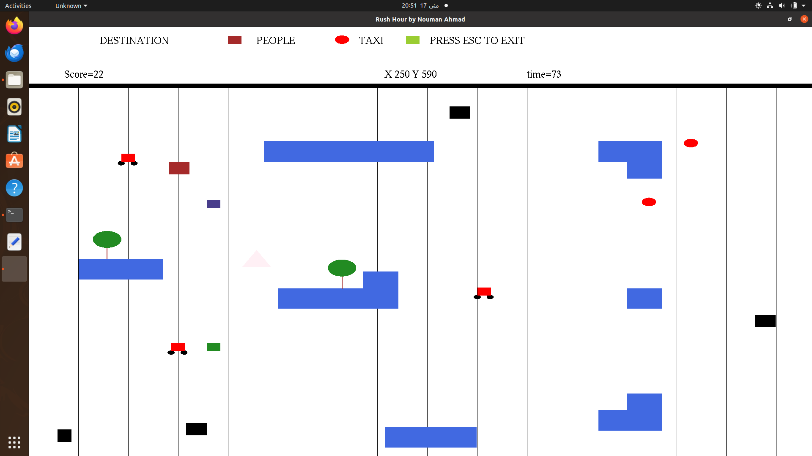

# RUSH-HOUR
## Project info
    The project was made using OPENGL glut library in c++, on ubuntu
## Application workflow
    - First open terminal and type './game' and type your name(4 char limit) and enter
    - You will be taken to menu page where you have option for either purple or green car
    - Your job is to pick passenger by getting near to them and hitting space (passenger->red circle)
    - And a random destination will be assigned on the board map and you have to reach their
    - To drop them hit space again
    - Now the game has time limit
    - Their is increment in score when pick and drop has been made
    - Decrement in score when collide with obstacles
    - after game is over the score will be stored in a txt file using file handling adjacent to them name
## Images
### HOME PAGE(STARTER PAGE)
 menu page
 

game running(green cab)

game running(purple cab)

# SETUP
- CLONE THIS REPO
- Have a working ubuntu os
  Have installed a c++
- Have install GLUT library
- Open terminal on the directory
- ./game

# 
